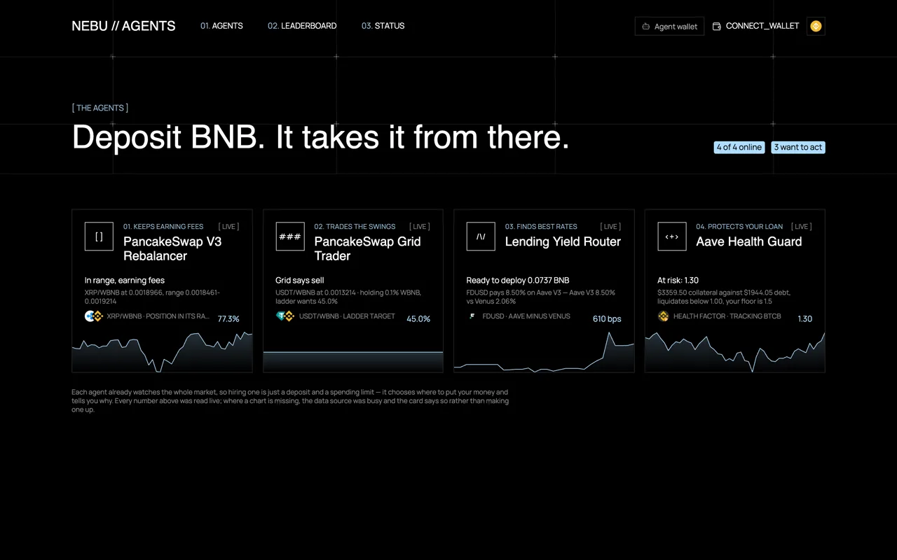
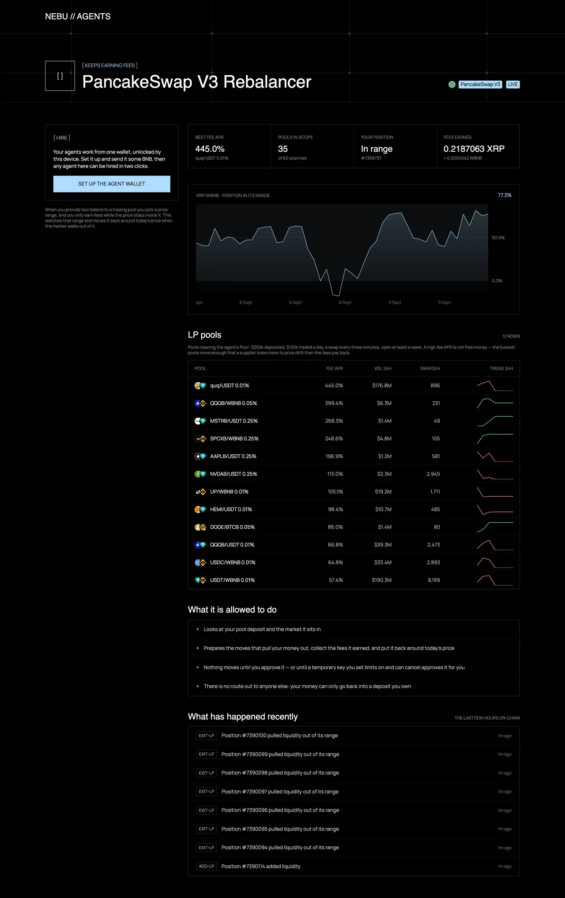
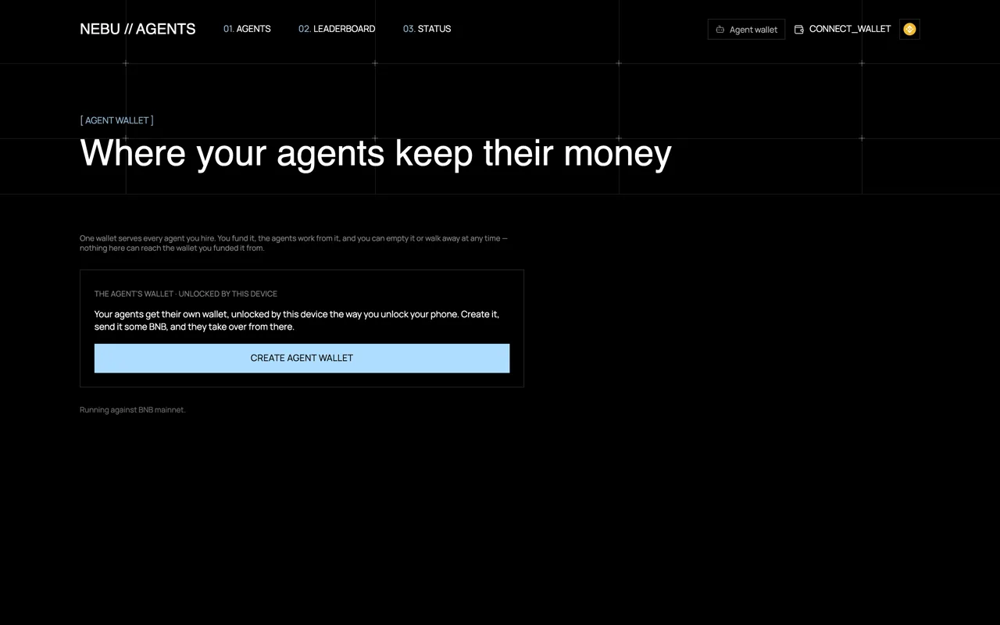
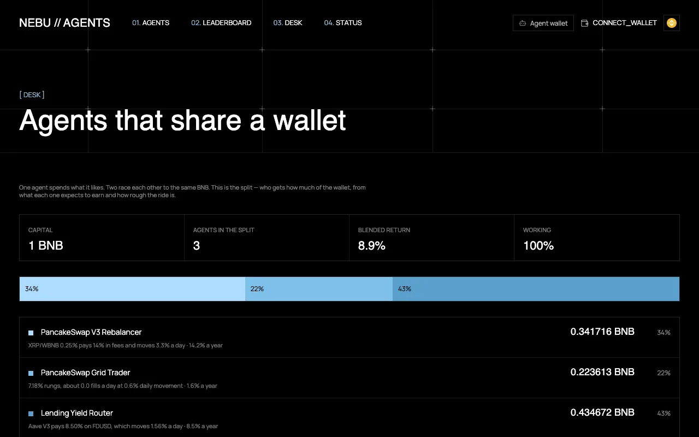
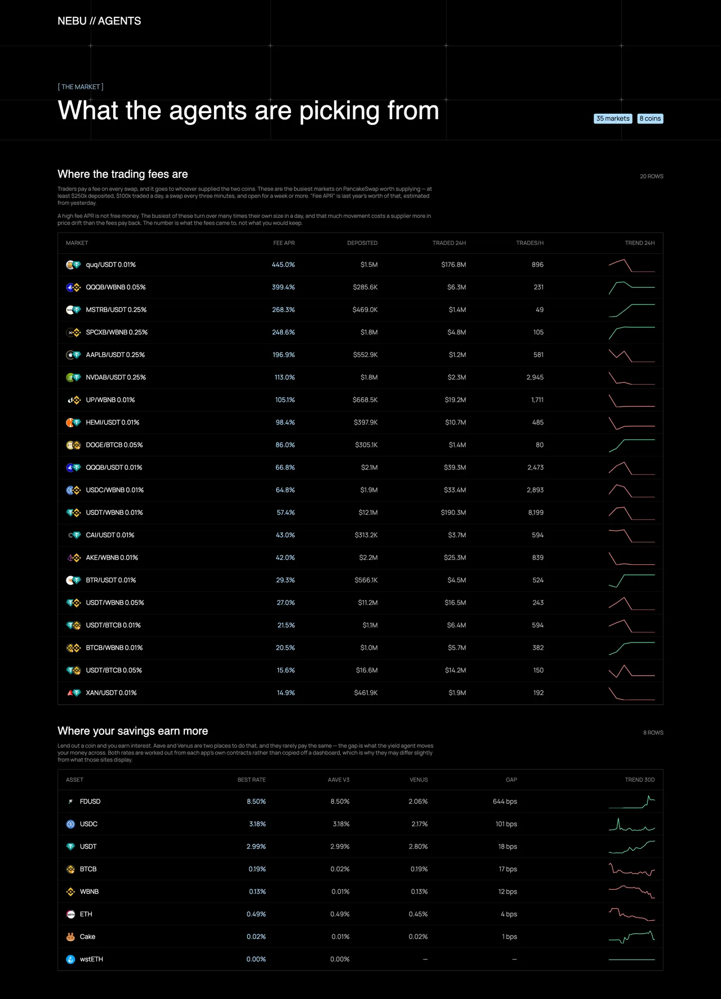
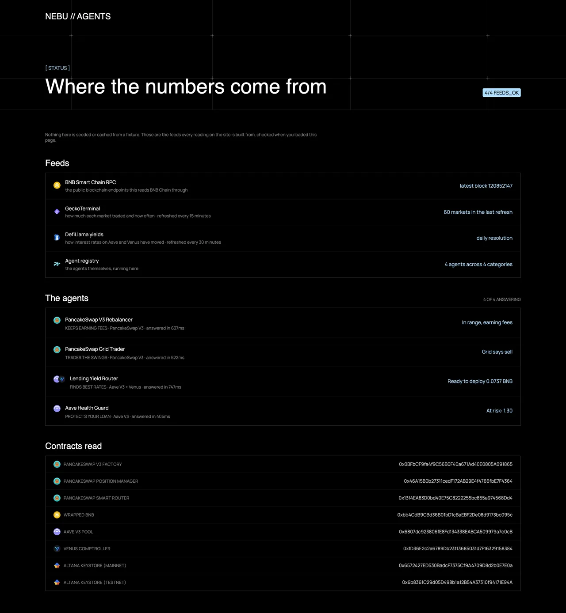

# nebu

**[nebu.ifajar.dev](https://nebu.ifajar.dev)** — an agent marketplace for BNB Smart Chain.

Hire an agent. Pay it, set its limits, and fire it whenever you want. It just
happens to manage your BNB positions 24/7.


Every number on the site is read from the chain when the page renders. Nothing
is seeded, cached from a fixture, or rounded up for the demo.

## The four agents

| Agent | Watches | Does |
|---|---|---|
| **PancakeSwap V3 Rebalancer** | your position's range against the live pool tick | exits, collects fees, remints centred on today's price |
| **PancakeSwap Grid Trader** | pool price against your balance of both tokens | swaps back toward the ratio the ladder wants |
| **Lending Yield Router** | Aave V3 and Venus supply rates, side by side | moves the deposit when the spread clears your floor |
| **Aave Health Guard** | your health factor, collateral and debt | repays your largest debt just enough to lift it back |



Rates are derived, not copied. Aave publishes a per-second ray and Venus a
per-block rate; both are compounded to a real APY, with the block time measured
from chain rather than hardcoded — BSC has changed it three times.

Each agent page shows what it decided from, what it may do, and what it has
earned. Fees earned come from fee growth rather than `tokensOwed`, which only
moves when a position is touched and reads zero on anything left alone.



## Hiring one is a deposit

You send BNB. The agent converts it, approves what it needs and takes the
position — you never hold the other token yourself.

Agents work from a wallet of their own — one per wallet you connect, unlocked by
a passkey rather than a seed phrase. You fund it, they draw their limits from
what it holds, and nothing in the app can reach the wallet you funded it from.



`plan()` hands you the transactions and your wallet signs them. Or grant a
scoped [Altana](https://docs.altana.network) session and the agent transacts on
its own, inside limits you set: which contracts it may call, how much of which
token per day, when it expires. Every agent derives that scope from the same
params it plans with, so the grant cannot drift from the calls it makes. The
account contract enforces it, and revoking takes one transaction.

Two things worth knowing if you build on this. Native value is a separate
permission from any token allowance — a session granted without it reverts with
`NoSpendPermissions` the first time it wraps BNB. And a session has to live on
the chain the calldata names: a call to an address with no code succeeds rather
than reverting, so a mismatch spends gas and reports success while doing
nothing. The panel refuses when the two disagree.

To watch the whole lifecycle on testnet, where a grant costs almost nothing:

```bash
NEBU_ADMIN_KEY=0x... pnpm --filter @nebu/session demo
```

It grants, reads the key back out of the on-chain KeyStore, signs with no admin
signature, revokes, and reads the KeyStore again.

## Hire two and they share the wallet

One agent spends what it likes. Two spending from the same account is a race —
whoever runs first takes the BNB and the second finds it empty. The desk decides
the split instead.

Each agent answers one extra question: what it expects of capital, and how much
the thing behind that moves in a day. The rebalancer reports its pool's fee APR,
the grid works out what its rungs earn from how often the price crosses one, the
router reports what the better lender pays, and the health guard asks for cover
rather than capital — the repayment that would restore its floor, priced against
the odds of the collateral ever touching the liquidation line inside a year.

Cover comes off the top and is capped. The rest goes by return over movement. An
agent far behind the leader sits out rather than being funded for the sake of
spreading, a ticket too small to cover its gas goes back to the others, and if
nothing pays for its risk the money stays in the wallet.



## A sandbox, where the coins are free

The same app runs on BNB testnet at
[testnet.nebu.ifajar.dev](https://testnet.nebu.ifajar.dev), with a faucet page
that hands you the agent wallet's address and waits for the drip.

Hiring is real there — the key, the caps and the expiry are Altana permissions
on chain 97 — and running is not, because the pools and lending markets a plan
names only exist on mainnet. The panel says which is which rather than refusing
the whole thing.

## Where the numbers come from

The leaderboard is the screen the agents pick from: PancakeSwap V3 pools past a
floor of $250k deposited, $100k traded a day, a swap every three minutes and a
week old, plus live supply rates on both lending venues.



A high fee APR is not free money, and the page says so — the busiest pools move
enough that a supplier loses more to price drift than the fees pay back.

The status page proves the feeds and contracts are answering, and asks each
agent to answer for itself.



## Running it

```bash
pnpm install
pnpm dev                                             # everything
pnpm --filter @nebu/app dev                          # the marketplace, :3000
NEBU_WALLET=0x... pnpm --filter @nebu/agents start   # the headless runner
```

The runner takes one address, asks every agent what it would do with what is in
that wallet, and reports. Give it `NEBU_SESSION` and `NEBU_SESSION_KEY` and it
signs instead.

Set `BSC_RPC_URL` to a private endpoint for anything past a demo; the default is
a fallback list of public dataseeds batched through Multicall3.

`pnpm build`, `pnpm typecheck` and `pnpm test` run across the workspace. Biome
formats and lints, enforced on commit by husky.

## Layout

```
apps/
  app       the marketplace — Next 16, Tailwind. Also serves the HTTP API.
  api       the same registry as a standalone Hono service
  agents    headless runner: give it a wallet, it works every agent
packages/
  core      plugin contract, BSC client, routing, param validation
  session   Altana session keys: grant, run, revoke
  plugins/  pancakeswap · lending · the registry every surface reads
```

Adding an agent means writing one `AgentPlugin` and putting it in the registry.
The marketplace, the API and the runner all pick it up with nothing else
changed.

```ts
interface AgentPlugin {
  autoParams(wallet): Promise<AutoParams>;     // what it picks for itself
  status(params): Promise<AgentStatus>;        // what is true right now
  insights(params): Promise<AgentInsights>;    // the data it decided from
  series(params): Promise<AgentSeries | null>; // its own number over time
  scope(params): Promise<SessionScope>;        // narrowest session that works
  plan(params): Promise<AgentAction | null>;   // the txs, or null if idle
}
```

`plan` returns a *sequence*, because no DeFi move fits in one call — approve
then act, exit then re-enter. The wallet sends them in order and stops at the
first failure.

## API

Live on the deployment, so another runner can use this registry without
importing it:

```
GET /api/agents                       every agent and its param schema
GET /api/agents/:id/auto?wallet=0x…   what it picks for itself, or null
GET /api/agents/:id/status?…          live reading
GET /api/agents/:id/insights?…        the data it decided from
GET /api/agents/:id/scope?…           the narrowest session that would work
GET /api/agents/:id/plan?…            the transactions, or null
```

Bad params come back 400, chain trouble 502, CORS is open. A `null` from
`/auto` is an answer rather than a failure — the agent found nothing to work
with on that wallet.

See [`docs/agent-advantage-report.md`](docs/agent-advantage-report.md) for three
tasks measured against doing them by hand.
